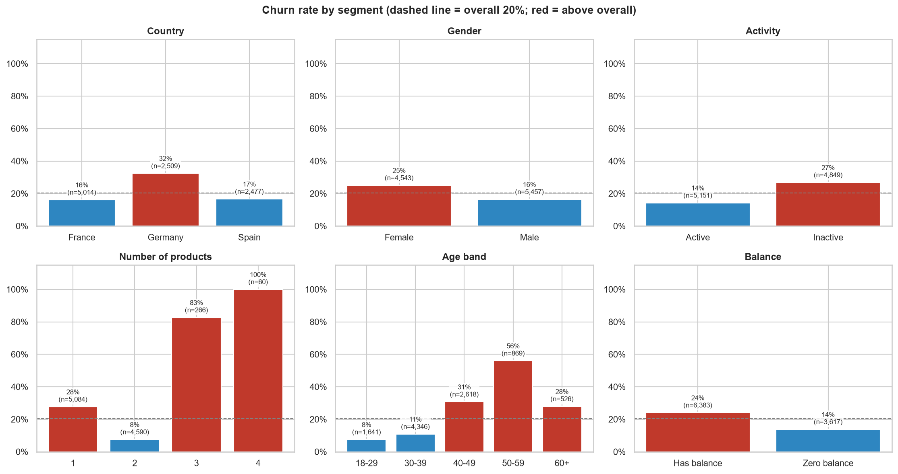
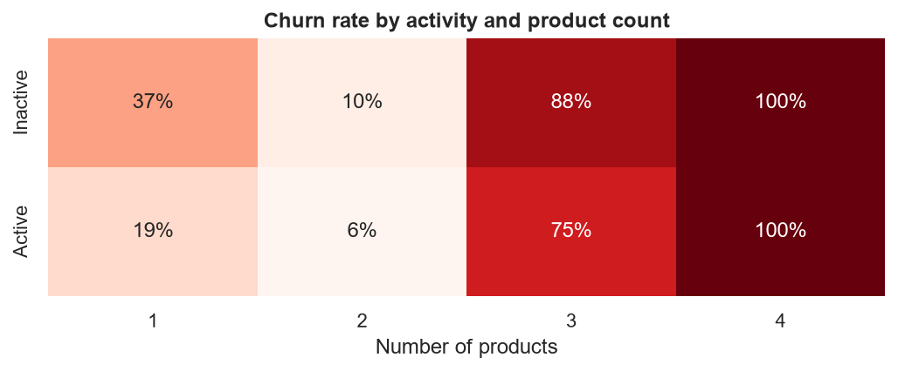
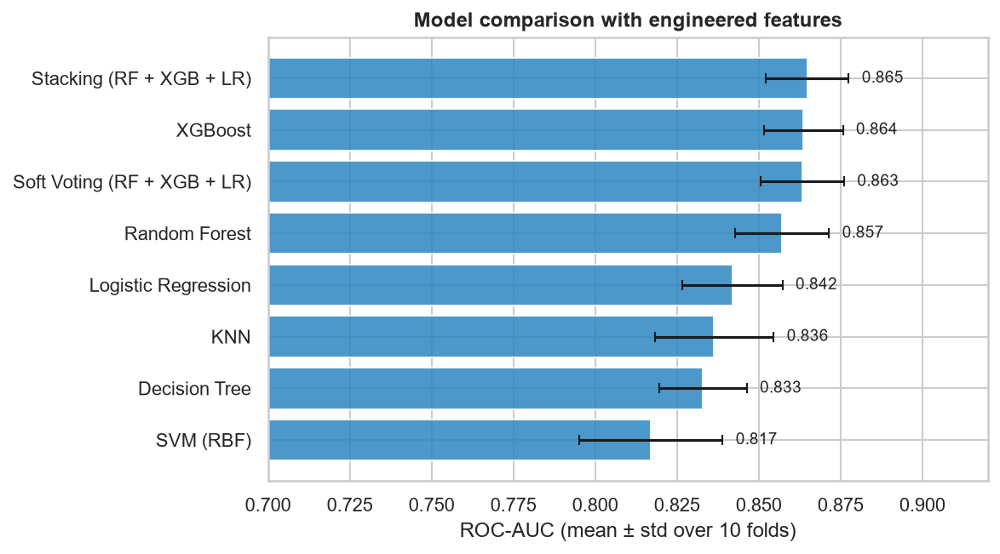
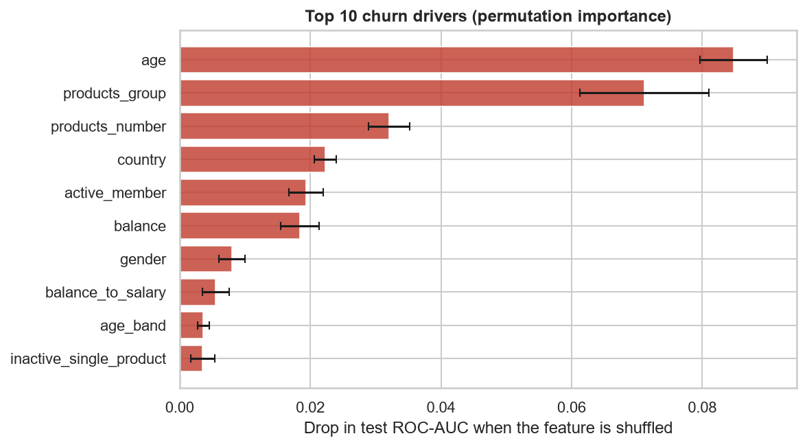
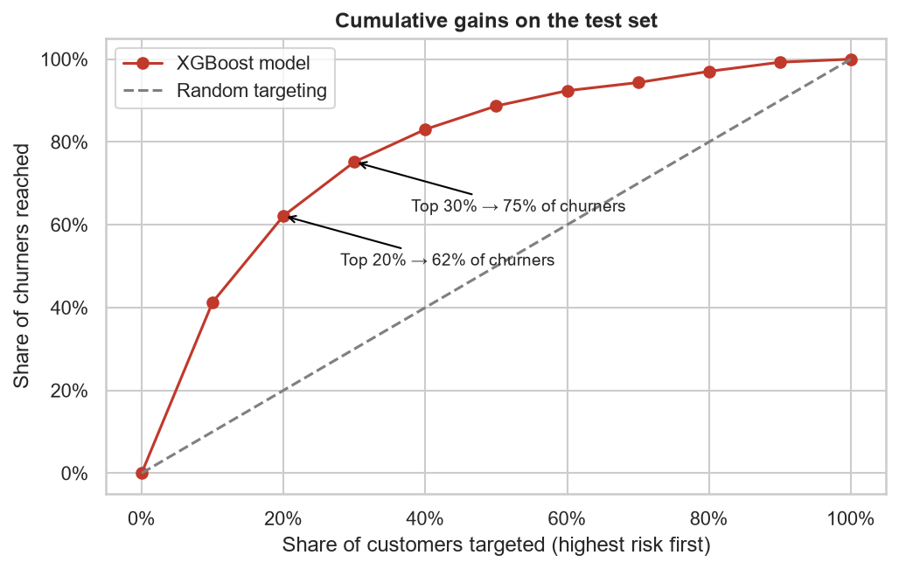
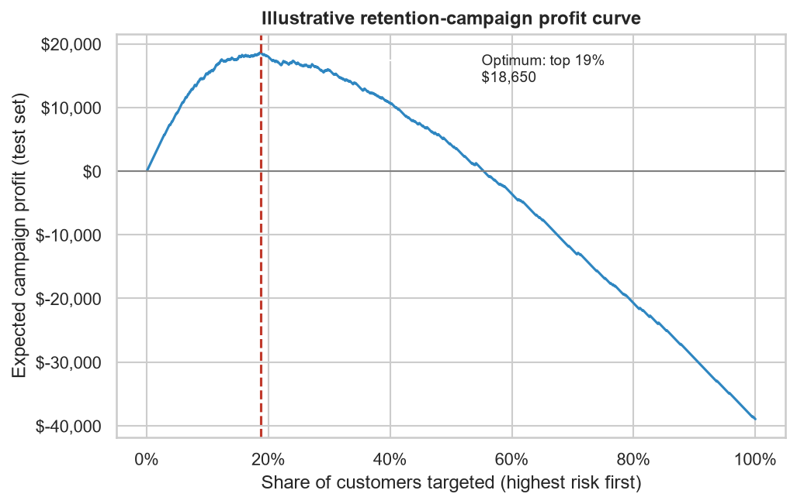

# Bank Customer Churn Prediction: from risk scores to retention decisions

Predict which bank customers are about to leave, explain **why**, and decide **who to target** with a retention
offer so the campaign actually pays off.

  

## Results at a glance

| | |
|---|---|
| **Best model** | XGBoost: **ROC-AUC 0.86**, **86.9% accuracy** on a held-out test set (2,000 customers) |
| **Targeting power** | Contacting the **top 20%** riskiest customers reaches **62% of all churners** (top 10% has **4.1x** the average churn rate) |
| **Campaign decision** | Under illustrative unit economics, targeting the **top 19%** yields **+$18.7K**; targeting everyone loses **-$39.0K** |
| **Biggest levers** | Age 40-60, product count (2 is the sweet spot), inactivity, and the German market |

## Business problem

ABC Multistate Bank loses **20.4%** of its customers. A blanket retention campaign is expensive and wastes offers on
customers who would have stayed anyway. The bank needs to know:

1. Which customer segments churn the most, and which signals really matter?
2. Can we rank customers by churn risk reliably?
3. How deep should a retention campaign go to maximize return?

## Data

[Bank Customer Churn Dataset](https://www.kaggle.com/datasets/gauravtopre/bank-customer-churn-dataset) (Kaggle):
10,000 customers, 12 columns (demographics, balance, products, activity), no missing values.
See [`dataset/README.md`](dataset/README.md) for the column dictionary and download steps.

## Key insights from the EDA



| Finding | Evidence |
|---|---|
| **Germany churns twice as much** | 32.4% vs. 16.2% (France) and 16.7% (Spain); German customers also hold ~2x the balance of French and Spanish customers |
| **Inactive members are the mass-risk group** | 48.5% of customers are inactive; they churn at 26.9% vs. 14.3% for active members |
| **Two products is the sweet spot** | 1 product: 27.7% churn, 2 products: **7.6%**, 3-4 products: **83-100%** |
| **Risk peaks at age 50-59** | 56.0% churn, versus ~10% for customers under 40 |
| **Some intuitive signals don't matter** | Tenure, estimated salary and credit-card ownership are **not statistically significant** (Welch t-test / chi-square, p > 0.05) |



Inactive single-product customers churn at **36.7%**, active two-product customers at only **5.6%**: moving
customers to a second product and keeping them active is the clearest lever.

## Modeling approach

1. **Feature engineering**: age bands, product groups (1 / 2 / 3+), zero-balance flag, balance-to-salary ratio,
   an *inactive single-product* flag and tenure-to-age ratio.
2. **Model comparison** with **10-fold stratified cross-validation** on the 80% training set: Logistic Regression,
   Decision Tree, Random Forest, KNN, SVM, XGBoost, plus **stacking** and **soft-voting** ensembles.
3. **Threshold tuning** on out-of-fold predictions (never on the test set), then a single evaluation on the 20% test set.
4. **Explainability** with permutation importance, and **business translation** with a cumulative-gains curve and a
   campaign-profit simulation.



| Model (engineered features, 10-fold CV) | ROC-AUC | Accuracy | Precision | Recall | F1 |
|---|---|---|---|---|---|
| Stacking (RF + XGB + LR) | 0.865 ± 0.013 | 86.2% | 0.76 | 0.48 | 0.59 |
| **XGBoost (selected)** | **0.864 ± 0.012** | **86.3%** | 0.76 | 0.49 | 0.59 |
| Soft Voting (RF + XGB + LR) | 0.863 ± 0.013 | 86.1% | 0.76 | 0.46 | 0.57 |
| Random Forest | 0.857 ± 0.014 | 85.9% | 0.76 | 0.45 | 0.56 |
| Logistic Regression | 0.842 ± 0.015 | 85.0% | 0.73 | 0.42 | 0.53 |
| KNN | 0.836 ± 0.018 | 84.6% | 0.78 | 0.34 | 0.47 |
| Decision Tree | 0.833 ± 0.013 | 85.6% | 0.77 | 0.43 | 0.55 |
| SVM (RBF) | 0.817 ± 0.022 | 85.6% | 0.79 | 0.40 | 0.53 |

- Feature engineering lifted **Logistic Regression from 0.763 to 0.842 ROC-AUC**; tree models already capture
  these non-linear effects.
- XGBoost and the ensembles are statistically tied, so **XGBoost** was selected: same performance, one model that
  is faster, simpler to maintain and easier to explain.

### Test-set performance (XGBoost, 2,000 unseen customers)

| Threshold | ROC-AUC | Accuracy | Precision | Recall | F1 |
|---|---|---|---|---|---|
| 0.50 (default) | 0.860 | 86.9% | 0.78 | 0.49 | 0.60 |
| **0.35 (tuned for F1)** | 0.860 | 85.5% | 0.65 | **0.62** | **0.63** |

Lowering the threshold trades a little precision for catching **62%** of churners instead of 49%, which matters
more when a missed churner costs more than an unnecessary offer.



## From predictions to a retention decision



| Customers targeted (highest risk first) | Share of churners reached | Churn rate in that slice |
|---|---|---|
| Top 10% | 41% | 84% (4.1x average) |
| Top 20% | 62% | 63% |
| Top 30% | 75% | 51% |

**Illustrative campaign ROI.** The dataset has no revenue or cost data, so this uses clearly stated assumptions:
a retained customer is worth **$500/year**, each offer costs **$50**, and the offer saves **30%** of would-be churners.



Targeting the **top 19%** maximizes expected profit (**+$18,650** on the test set), while contacting every customer
**loses $38,950**. The exact optimum depends on the real unit economics; the method is what transfers.

## Recommendations

1. **Score customers monthly and target by risk**, not with blanket campaigns.
2. **Match the offer to the driver**: re-activation nudges for inactive members, a second-product offer for
   single-product customers, a focused review of the German market, and an audit of 3-4 product bundles.
3. **Measure incrementality** with a random hold-out group so the real save rate replaces the 30% assumption,
   then re-tune how deep to target.

**Limitations:** a single public dataset with no time dimension and no revenue data; the ROI section demonstrates
the method rather than forecasting real returns.

## What changed vs. the 2023 report

This repository re-implements the [2023 university report](docs/2023_university_report.pdf) from scratch on the same
dataset. Most conclusions hold, but several measurement choices and a few figures were corrected. Every number in this
README can be reproduced from the notebooks.

| Area | 2023 report | This repo | Why it changed |
|---|---|---|---|
| EDA charts | Churner counts, pie chart, correlation heatmap | Churn **rates** by segment, significance tests, activity x products heatmap | Rates show relative risk correctly on imbalanced data (France and Germany have similar churner *counts*, but Germany's *rate* is 2x) |
| Precision / recall | ~0.9 for most models (appears to be for the non-churn class) | Reported for **churners** | Churners are the class a retention team acts on |
| ROC in model tables | 0.68-0.80 (appears to be computed from 0/1 predictions) | 0.82-0.87 from **predicted probabilities** | Standard ROC-AUC; the 2023 voting model, measured this way in the report's discussion, also reached 0.86 |
| Logistic Regression | ~70% accuracy, below the 80% "predict no churn" baseline | 85% accuracy | Numeric features are now scaled inside a pipeline |
| Features | Dropped tenure, salary and credit card after significance tests | Kept, plus engineered bands and flags | Same statistical conclusion; keeping them costs little and the engineered features lift linear models |
| Figures | Germany 48% churn; 3-product customers 79% | Germany **32.4%**; 3-product customers **82.7%** | Recomputed directly from the dataset |
| Business layer | Qualitative recommendations | Threshold tuning, cumulative gains, campaign ROI | Turns risk scores into a targeting decision |

**What stayed the same:** the significance-test conclusions (tenure, salary and credit-card ownership are not linked to
churn), the churner profile (average age 45 vs. 37 for retained customers, 56% female), the 48% inactive share, and the
recommendation to use a decision threshold in the 0.2-0.5 range (this repo's tuned threshold is 0.35).

## Project structure

```
customer-churn-prediction/
├── notebooks/
│   ├── 01_eda.ipynb          # segment analysis, significance tests, key takeaways
│   └── 02_modeling.ipynb     # feature engineering, CV comparison, test evaluation, gains & ROI
├── src/churn/
│   ├── data.py               # loading, integrity checks, feature engineering
│   └── modeling.py           # model zoo, cross-validation, gains table, campaign profit
├── reports/
│   ├── figures/              # charts used in this README
│   ├── model_comparison.csv
│   ├── test_metrics.csv
│   └── gains_table.csv
├── dataset/README.md         # data source and column dictionary (CSV not included)
├── docs/
│   └── 2023_university_report.pdf   # original team report (teammate names and student IDs redacted)
└── requirements.txt
```

## How to run

```bash
git clone https://github.com/tramynee2322/customer-churn-prediction.git
cd customer-churn-prediction
python -m venv .venv
.venv\Scripts\activate          # macOS/Linux: source .venv/bin/activate
pip install -r requirements.txt
# download the CSV into dataset/ (see dataset/README.md), then:
jupyter notebook notebooks/
```

The full pipeline runs in about 4 minutes on a laptop; all random seeds are fixed for reproducibility.

## Background

This project started as a **2023 university team project** (University of Economics and Law, VNU-HCM) comparing
machine-learning techniques for customer churn, where I worked across EDA, modeling and business recommendations.
This repository is my **individual re-implementation**, extended with threshold tuning, explainability and the
retention-targeting and ROI analysis. See [What changed vs. the 2023 report](#what-changed-vs-the-2023-report) for the
differences.

## References

- 2023 university team report: *Machine Learning Techniques for Customer Churn: A Comparative Study*, University of
  Economics and Law, VNU-HCM ([PDF](docs/2023_university_report.pdf); teammates' names and all student IDs are redacted for privacy)
- Dataset: [Bank Customer Churn Dataset](https://www.kaggle.com/datasets/gauravtopre/bank-customer-churn-dataset), Kaggle

**Le Thi Tra My**, Data Analyst · [LinkedIn](https://www.linkedin.com/in/lttmyt2302/) · [Portfolio](https://tramynee2322.github.io/my-portfolio/)
